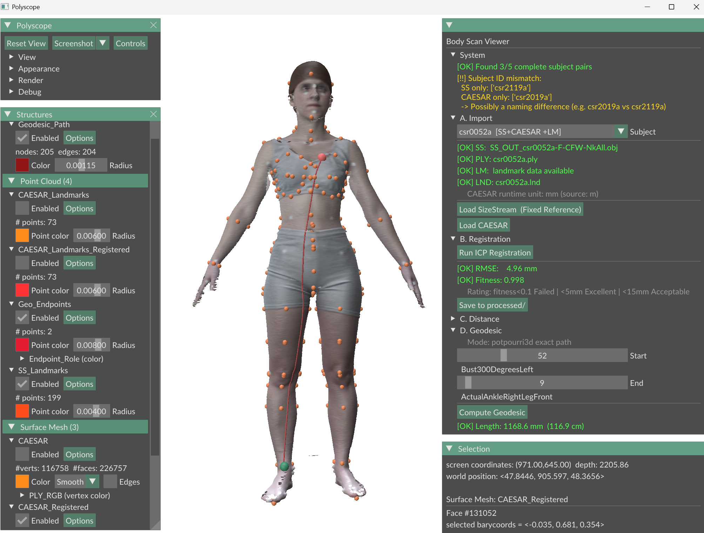
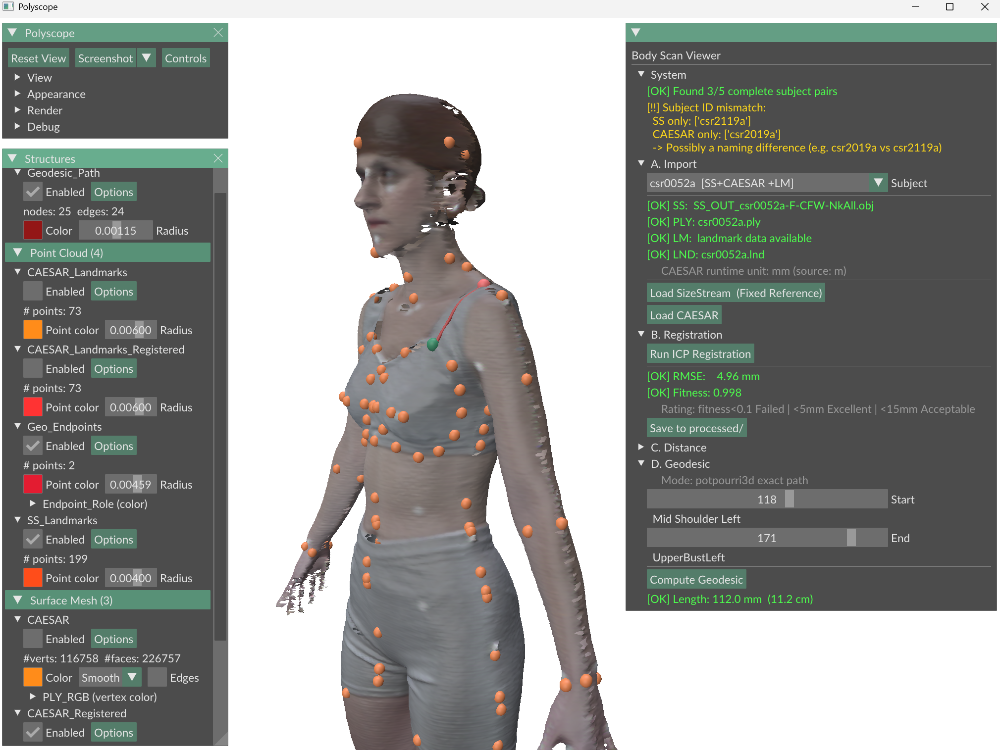

# Body Scan Viewer



An interactive 3D desktop application for comparing and analyzing human body scans from two sources — **SizeStream** (reference geometry) and **CAESAR** (subject scans) — with ICP rigid registration, landmark error heatmaps, and geodesic surface measurements.

---

## Key Features

- **Automatic subject discovery** — scans data folders on startup and populates a subject selector; no manual file paths required
- **Coarse-to-fine ICP registration** — two-stage Point-to-Plane ICP (150 mm → 25 mm search radius) with automatic axis-alignment and quality rating
- **Landmark distance heatmap** — per-vertex color mapping of registration error with an adjustable color scale slider
- **Geodesic surface measurement** — exact surface-distance path between any two landmarks using `potpourri3d`, with a Dijkstra fallback
- **Split configuration** — rendering settings (`render_config.json`) are separate from dataset paths and algorithm parameters (`project_config.json`), so switching projects requires editing only one file

---

## Tech Stack

| Layer | Technology |
|---|---|
| 3D viewer & GUI | [Polyscope](https://polyscope.run/) 2.5 + ImGui |
| Mesh I/O | [trimesh](https://trimesh.org/) 4.11 |
| ICP registration | [Open3D](http://www.open3d.org/) 0.19 |
| Geodesic solver | [potpourri3d](https://github.com/nmwsharp/potpourri3d) 1.3 |
| Landmark data | pandas 2.3 + openpyxl 3.1 (SizeStream XLSX), custom `.lnd` parser (CAESAR) |
| Numerical / spatial | NumPy 1.26, SciPy 1.13 |
| Color mapping | Matplotlib 3.9 |
| Language | Python 3.9 |

---

## Getting Started

### Prerequisites

- Python **3.9.x** (tested on 3.9.17)
- Windows, Linux, or macOS (Polyscope requires a display; no headless support)
- A GPU or OpenGL-capable display driver

### Installation

```bash
# 1. Clone the repository
git clone <YOUR_REPO_URL>
cd <repo-folder>

# 2. (Recommended) Create and activate a virtual environment
python -m venv venv
# Windows:
venv\Scripts\activate
# Linux / macOS:
source venv/bin/activate

# 3. Install dependencies
pip install -r requirements.txt
```

### Configure data paths

Edit **`config/project_config.json`** (the only file you need to touch per project):

```jsonc
{
  "paths": {
    "data_root":        "<PATH_TO_PROJECT_ROOT>",
    "size_stream_dir":  "<PATH_TO_PROJECT_ROOT>/SIZE_STREAM",
    "caesar_dir":       "<PATH_TO_PROJECT_ROOT>/CAESAR",
    "processed_dir":    "processed"
  }
}
```

Expected data layout inside those folders:

```
SIZE_STREAM/
    SS_OUT_<subject>.obj        ← mesh
    <landmarks>.xlsx            ← SizeStream landmark workbook

CAESAR/
    csr<subject>.ply            ← mesh (meters or millimeters)
    csr<subject>.lnd            ← landmark file (optional)
```

### Run

```bash
python main.py
```

---

## Project Structure

```
.
├── main.py                  # Entry point — initializes Polyscope and wires up MVVM layers
├── config_loader.py         # Strict schema-validated JSON loader; exports APP_CONFIG singleton
├── geometry_backend.py      # Model — all geometric state and computation (VisContent class)
├── gui_panel.py             # View — ImGui control panel, per-frame render callback (UI_Menu class)
├── data_loader.py           # File discovery, XLSX/LND landmark parsing, coordinate diagnosis
├── registration.py          # Coarse-to-fine ICP pipeline (CAESAR → SizeStream)
├── geodesic_utils.py        # Edge graph, potpourri3d exact solver, Dijkstra fallback
├── unit_utils.py            # Mesh unit inference and mm ↔ original-unit conversion
├── colorBar.py              # RGB heatmap color mapping (blue → cyan → green → yellow → red)
│
├── config/
│   ├── project_config.json  # ← EDIT THIS per project: paths, ICP params, distance scale
│   └── render_config.json   # Viewer and visual appearance settings (shared across projects)
│
├── tests/                   # pytest test suite (unit + behavior tests)
│
├── requirements.txt         # Direct runtime dependencies (9 packages)
└── processed/               # Output folder: <subject>_registered.ply + <subject>_transform.npy
```

---

## Usage

The application is driven entirely through the Polyscope side panel. Work through panels **A → D** in order:

### A. Import

1. Select a subject from the **Subject** dropdown (auto-populated on startup).
2. Click **Load SizeStream (Fixed Reference)** — loads the OBJ mesh and XLSX landmarks.
3. Click **Load CAESAR** — loads the PLY mesh and `.lnd` landmarks; detects unit (m vs mm) automatically.

### B. Registration

Click **Run ICP Registration** to align the CAESAR scan to the SizeStream reference.
The panel displays RMSE (mm), fitness score, and a quality rating:

| RMSE | Rating |
|---|---|
| < 5 mm | Excellent |
| 5 – 15 mm | Acceptable |
| > 15 mm | Needs review |
| Fitness < 0.1 | Failed |

Click **Save to processed/** to export the registered mesh and 4 × 4 transform matrix.

### C. Distance

Adjust the **Color Max (mm)** slider to calibrate the heatmap sensitivity, then click **Compare Distances**.
The panel reports mean, max, and std landmark error across all matched landmarks.

### D. Geodesic



Drag the **Start** and **End** sliders to select two landmarks — the endpoint preview updates live in the 3D viewport.
Click **Compute Geodesic** to calculate the shortest surface path; the result is displayed in mm and cm.

---

## Configuration Reference

### `config/project_config.json` — change per dataset

| Key path | Description |
|---|---|
| `paths.data_root` | Root folder containing `SIZE_STREAM/` and `CAESAR/` |
| `registration.quality.*` | RMSE thresholds for Excellent / Acceptable rating |
| `registration.coarse_icp.*` | Max correspondence distance and iterations for coarse pass |
| `registration.fine_icp.*` | Max correspondence distance and iterations for fine pass |
| `distance.default_color_max_mm` | Starting upper bound for the distance heatmap |

### `config/render_config.json` — shared visual settings

| Key path | Description |
|---|---|
| `viewer.up_dir` | Polyscope up-axis (`y_up` matches SizeStream convention) |
| `render.sizestream_mesh.color` | RGB fallback color for the reference mesh |
| `render.sizestream_mesh.transparency` | Mesh transparency `[0, 1]` |
| `render.<structure>.enabled` | Whether a structure is visible immediately after loading |

---

## Running Tests

```bash
pytest tests/
```
