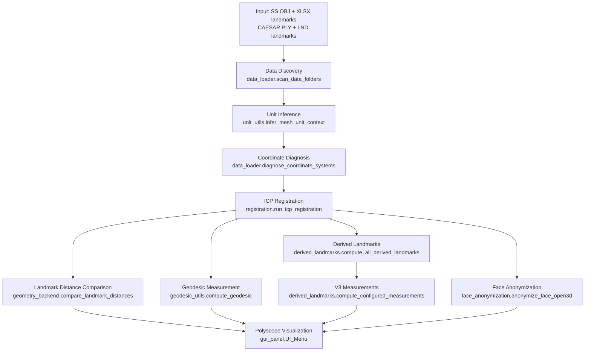
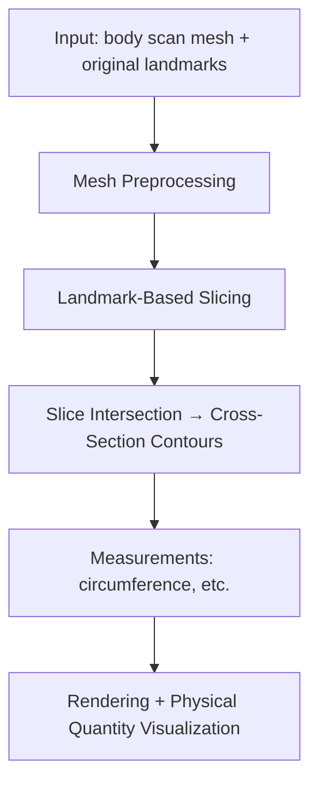

# Architecture

## 当前 Pipeline（已实现）



## 未来 Pipeline（规划中）



## 代码架构（Model-View pattern）

```
main.py                        Entry point — Polyscope init + wiring
  ├── config_loader.py         Config singleton (APP_CONFIG) — JSON only
  ├── geometry_backend.py      Model layer (VisContent class)
  │     ├── data_loader.py           Data discovery + parsing
  │     ├── unit_utils.py            Unit inference + conversion
  │     ├── registration.py          ICP pipeline
  │     ├── geodesic_utils.py        Geodesic computation
  │     ├── colorBar.py              Distance-to-color mapping
  │     ├── derived_landmarks.py     V3 derived landmarks + measurements + YAML I/O
  │     └── face_anonymization.py    Face anonymization (Open3D proxy)
  └── gui_panel.py             View layer (UI_Menu class) — Panels A-F
```

Config files:
```
config/
  ├── project_config.json      Data paths + ICP + distance params
  ├── render_config.json       Viewer + render visual settings
  └── derived_landmarks.yaml   Derived landmark + measurement definitions
```

## 模块地图

### Data IO
状态：**已实现**
→ [[data_io/design]]

### Landmark Schema
状态：**已实现**（SS XLSX + CAESAR LND 解析和对齐 + derived landmark 重心坐标框架）
→ [[landmark_schema/design]]

### Unit Management
状态：**已实现**
→ [[unit_management/design]]

### Registration（ICP 配准）
状态：**已实现**
→ [[registration/design]]

### Measurements（度量）
状态：**部分实现**（geodesic + Euclidean + V3 geodesic 12 + Y-projection 4 + arc_length 18 + euclidean 3D 2；围度待实现）
→ [[measurements/design]]

### Rendering（可视化）
状态：**已实现**（Polyscope + ImGui，Panels A-F）
→ [[rendering/design]]

### Mesh Processing（mesh 基础处理）
状态：**部分实现**（non-manifold cleaning for geodesic solver）
→ [[mesh_processing/design]]

### Face Anonymization（面部匿名化）
状态：**已实现**（Open3D proxy + vertex smoothing + boundary falloff）
→ [[face_anonymization/design]]

### Derived Landmarks（V3 重心坐标参数化）
状态：**部分实现**（8 Neck/Armhole done, 6 Waist init_method done 待数据验证；YAML 配置 + GUI Panel E）
→ `derived_landmarks.py`, `config/derived_landmarks.yaml`

### Mesh Slicing（切片）
状态：**未实现 — 规划中**
→ [[mesh_slicing/design]]

## 数据流

```
Input: SS OBJ mesh + XLSX landmarks
       CAESAR PLY mesh + LND landmarks
  → data_loader (scan folders, parse XLSX three-row-groups, parse LND)
  → unit_utils (infer m/mm, normalize to runtime mm)
  → data_loader (align CAESAR landmarks to mesh via 24-rotation search + ICP)
  → data_loader (diagnose coordinate systems: detect up-axis)
  → registration (axis swap → centroid → coarse ICP → fine ICP; 参数见 settled.md)
  → geometry_backend (landmark distance: trimesh.proximity.closest_point)
  → geodesic_utils (build edge graph + potpourri3d solver; compute path)
  → derived_landmarks (YAML config → init_method → barycentric coords → measurements)
  → face_anonymization (Open3D proxy → vertex smoothing → topology verify)
  → colorBar (distance → RGB heatmap)
  → gui_panel (Polyscope ImGui rendering, Panels A-F)
Output: 3D visualization + registered PLY + transform NPY + V3 Excel export
```

## 依赖关系

| 模块 | 依赖库 | 版本 |
|------|--------|------|
| 3D viewer + GUI | polyscope | 2.5.0 |
| Mesh I/O | trimesh | 4.11.0 |
| ICP registration + face anon | open3d | 0.19.0 |
| Geodesic solver | potpourri3d | 1.3 |
| Landmark data | pandas + openpyxl | 2.3.3 + 3.1.5 |
| Numerical / spatial | numpy + scipy | 1.26.4 + 1.13.1 |
| Color mapping | matplotlib | 3.9.4 |
| YAML config | PyYAML | — |
| Geometry (cross-sections) | shapely + rtree | 2.0.7 + 1.4 |
| Python | | 3.9.x |
