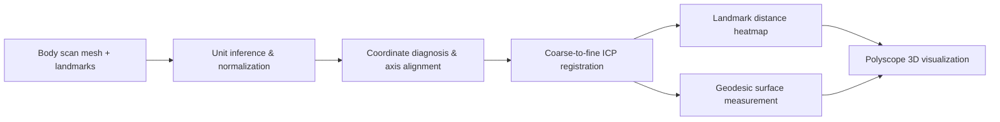

# Project: Body Scan Landmark + Measurement Framework

## 一句话

在 body scan mesh 上加载/对齐 landmarks，通过 ICP 配准对比双源扫描，
计算 landmark 距离热图和 geodesic surface distance，渲染可视化验证结果。
未来扩展：面部匿名化、切片交线、derived landmarks、更多物理度量。

## 当前状态

- 已完成：SizeStream/CAESAR 双源加载、单位自动推断(m/mm)、ICP 配准、landmark 距离热图、geodesic 测量、配置系统
- 进行中：无
- 阻塞：landmark schema 是否需要冻结、度量公式体系是否需要扩展
- 下一步：[[002_Architecture/roadmap]]

## 当前 Pipeline

→ [[002_Architecture/architecture]]

## 未来 Pipeline（规划中）

## 已定论

→ [[002_Architecture/settled]]

## Agent Boot

→ [[005_AgentMgmt/INDEX]]（唯一权威 boot 序列，按 Step 0-4 顺序执行）
