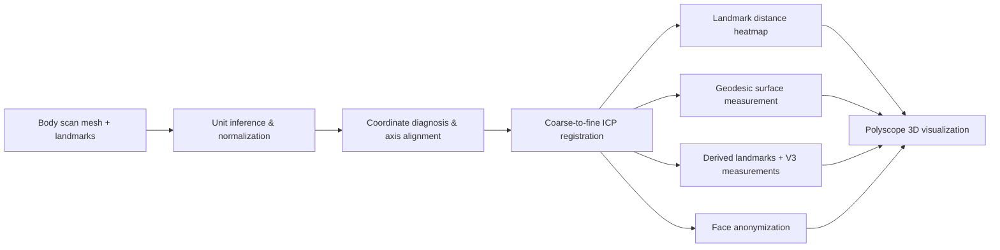
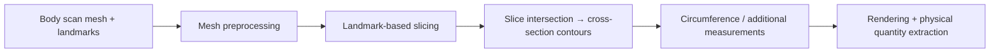

# Project: Body Scan Landmark + Measurement Framework

## 一句话

在 body scan mesh 上加载/对齐 landmarks，通过 ICP 配准对比双源扫描，
计算 landmark 距离热图和 geodesic surface distance，derived landmarks（重心坐标参数化）+ V3 度量，
面部匿名化（Open3D proxy），渲染可视化验证结果。
未来扩展：切片交线、围度。

## 当前状态

- 已完成（Phase 1）：SizeStream/CAESAR 双源加载、单位自动推断(m/mm)、ICP 配准、landmark 距离热图、geodesic 测量、配置系统
- 已完成（Phase 2 部分）：V3 derived landmarks (8 Neck/Armhole done)、12 geodesic + 4 Y-projection 度量、YAML 配置、GUI Panel E、面部匿名化 (Open3D)、GUI Panel F
- 进行中：Phase 2 — V3 Waist/Thigh 跨 subject 数据验证 + 权重持久化（init_methods 和度量引擎均已实现）
- 阻塞：切面约定定义（切片模块前置）、围度公式
- 下一步：[[002_Architecture/roadmap]]

## 当前 Pipeline

→ [[002_Architecture/architecture]]

## 未来 Pipeline（规划中）

## 已定论

→ [[002_Architecture/settled]]

## Agent Boot

→ [[005_AgentMgmt/INDEX]]（唯一权威 boot 序列，按 Step 0-4 顺序执行）
